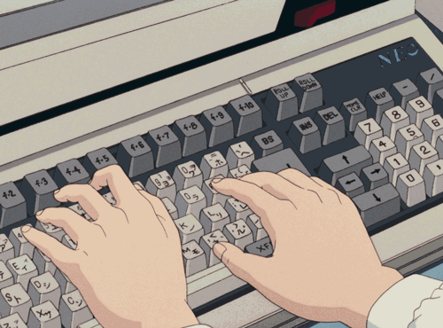

    

<h1 align="Center">👨‍💻 About Me</h1>

🤠Hi! I'm Nico. My main areas of interest are Ruby on Rails and AI automation.

###

<h2 align="center">💻 Tech Stack</h2>

    
    
    
    
    
    
    
    
    
    
    
    
    
    
    
    
    
    
    </a>
    
    
    
    

###

<h2 align="center">🔥 My Stats</h2>

    

###
